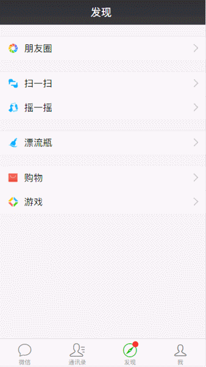
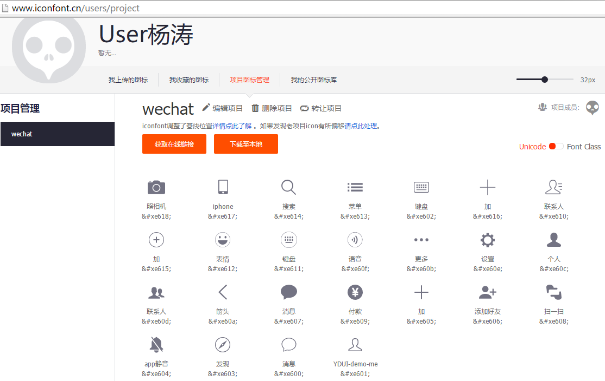
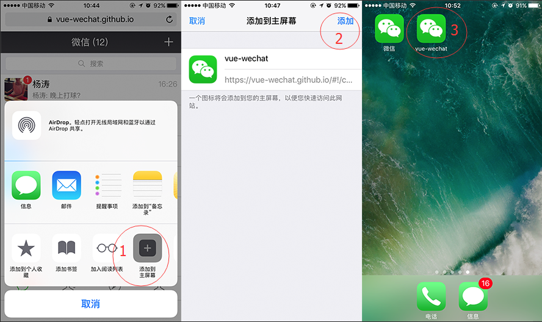

# vue-wechat
  用vue.js开发微信app

### 已将《用vue2开发微信app界面》提到2017日程中。
#### 开发完善的功能，如实现注册账号，加好友，实现聊天功能，等等，
#### 个人开发，精力有限，请各位持续关注。
#### 主要初衷还是自己可以通过个人项目实践新技术，在业务中发现问题，积累经验。并且可以与各位交流发现不足。

  线上地址:  [vue-wechat.github.io](https://vue-wechat.github.io)

  项目地址:  [useryangtao/vue-wechat](https://github.com/useryangtao/vue-wechat)

  github.io 加载略慢, 建议clone本地调试预览。


### 安装

``` bash
# install dependencies
cnpm install

# serve with hot reload at localhost:8080
npm run dev

# build for production with minification
npm run build

```
### 技术栈
  vue-wechat是主要在利用Vue.js * 实现了微信app及很多细节。

  此demo在实现上使用了以下技术
  
  - vue
  - vuex
  - vue-cli
  - vue-router
  - vue-touch
  - vue-animated-list
  - weui
  - zepto
  - fastclick

#### 一些亮点

  新页面跳转的过渡动画 参照ios系统的页面切换风格,是通过router-view及transition特性结合实现的。
  
  消息列表页的item 左划操作处理,使用vuex(getters,actions)实现实时处理计算数据
  
  (语音/文字)对话框 组件间 动画切换，还有通过事件注册tap 实现 按住说话效果；

  还有一些交互行为细节及动画：
   - 如css3动画实现的扫一扫;
   - 删除消息列表item，通过vue-animated-list 实现动画移除;
   - 消息页右上角+的显出无动画，隐藏有动画；
  
  朋友圈下拉拖拽显示完整封面
  
  listview部分也使用了weui的结构。 
  
  小图标全部使用iconfont方式,减少图片请求。
  

###手机预览(QR)

  
  
  如微信扫码浏览空白，请 点击右上角-> 浏览器 打开
  首次加载都很慢,请耐心等待。


### 基本操作

  主页

  

  页面切换,动画过渡
  (仿照ios系统切换风格:下一页打开时,当前页左偏移-30%;当前页关闭时,上一页左偏移从-30%过渡到0%)

  

  消息列表 (未读/已读)操作 及 删除

  

  按下说话,松开结束 效果

  

  发现-朋友圈

  

  发现-扫一扫

  

  图标-iconfont

#### 为了减少图片加载,图标使用的iconfont

  

### 添加到主屏幕

  


### 开发约定
  ``` bash
  所有组件.vue名 都统一 《短横线》 命名
  css内下划线( _ )开始的为通用类
  js中内下划线( _ )开头的为私有属性
  所有events均使用短横线 命名
  所有组件(.vue)里template标签包含的元素必须是component-xx 开头
  所有state统一下划线 命名
  所有 action统一下划线命名
  ```


### 参考

  [Vue-cnodejs](https://github.com/shinygang/Vue-cnodejs)

  [vue-zhihu-daily](https://github.com/hilongjw/vue-zhihu-daily)

  [vue-mobile-qq](https://github.com/hilongjw/vue-mobile-qq)

  [vue-shopping](https://github.com/andylei18/vue-shopping)

### 关于作者

微博:[Water杨涛](http://weibo.com/u/3503321141)

  
